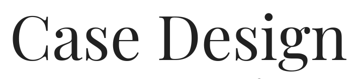
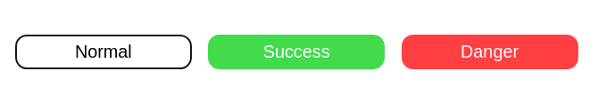

# Case Design

<center>

</center>

A Thoughtful Design Language. Case Design is a small CSS and sass library focused on clarity.

[Demo](https://godcrampy.github.io/case-design/)

## Installing

**npm**:

`$ npm install case-design`

**yarn**:

`$ yarn add case-design`

## Table of Contents

- [Typography](#1.-typography)
- [Quote](#2.-quote)
- [Buttons](#3.-buttons)
- [Card](#4.-card)
- [Form](#5.-form)

### 1. Typography

```html
<h1 class="title">Title</h1>
<h2 class="subtitle">Subtitle</h2>
<h3 class="h1">Heading 1</h3>
<h3 class="h2">Heading 2</h3>
<h3 class="h3">Heading 3</h3>
<h3 class="h4">Heading 4</h3>
<p class="text">Some Text</p>
<a>Link to Somewhere</a>
```


### 2. Quote

```html
<p class="quote">"Somone Said This"</p>
```


### 3. Buttons

```html
<button class="button">Normal</button>
<button class="button success">Success</button>
<button class="button danger">Danger</button>
```



### 4. Card

```html
<div class="card">
  <h1 class="h1">Title</h1>
  <h2 class="h3">@someone</h2>
  <p class="text">
    Lorem ipsum dolor sit amet consectetur adipisicing elit. Laborum sunt
    provident, enim, est maxime tenetur nobis ad rem ut facilis qui, error
    eveniet aut explicabo quod. Assumenda adipisci quidem dicta.
  </p>
</div>
```


### 5. Form

```html
<form>
  <label>Name: <input type="text" placeholder="John Doe"></input></label><br>
  <label>Details:<br />
    <textarea placeholder="Comments"></textarea></label><br />
  <button class="button" type="submit">Submit</button>
</form>
```


## Authors

- **Sahil Bondre** - [godcrampy](https://github.com/godcrampy)
